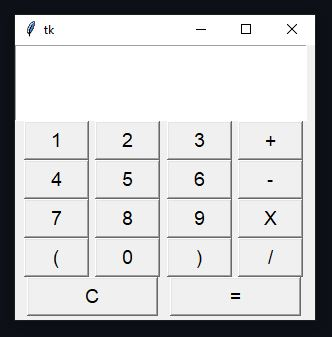

# 🧮 Simple Calculator – Python (Tkinter)

<p align="center">
  <a href="https://www.python.org/"></a>
  <a href="https://docs.python.org/3/library/tkinter.html"></a>
  <a href="https://github.com/genesisvaca/Calculator"></a>
</p>

💻 *A minimal, classic calculator built entirely with **Python Tkinter** — my **first GUI project ever**!* 💻

## 📸 Preview

<p align="center">
  
  <br>
  <em>A simple yet functional Tkinter calculator interface.</em>
</p>

## 🚀 Features

- ➕ Basic arithmetic operations: `+`, `-`, `×`, `÷`
- 🧮 Parentheses support for compound expressions
- ⚙️ Real-time display of inputs and results
- 🚫 Error handling for invalid inputs
- 💡 Clean, intuitive interface for beginners


## 🛠️ Tech Stack

| Technology | Description |
|-------------|-------------|
| **Python 3** | Core programming language |
| **Tkinter** | Built-in Python library for GUI applications |


## 📦 Installation

Make sure you have Python installed on your system.  
[🔗 Download Python here](https://www.python.org/downloads/)

```bash
git clone https://github.com/genesisvaca/Calculator.git
cd Calculator
```

## ▶️ How to Run

Run the following command to start the calculator:
```
python main.py
```

A window will open — click the buttons to input numbers and operations!

## 🧠 How It Works

- A `Text` widget displays both input and output.

- Each `Button` widget appends symbols or numbers to the expression.

- The result is computed using Python’s built-in `eval()` for simplicity.

- Basic validation prevents crashes on invalid entries.

## ⚠️ Note

The use of `eval()` is safe in this educational context, but not recommended for production applications where user input may be unsafe.

## 🌟 Author

**👩‍💻 Génesis Vaca Palma**  
📍  Data & Analytics Student — Madrid, Spain  
📧 [genesisvacapalma@gmail.com](mailto:genesisvacapalma@gmail.com)  
🔗 [LinkedIn](https://www.linkedin.com/in/genesisvaca/)  

